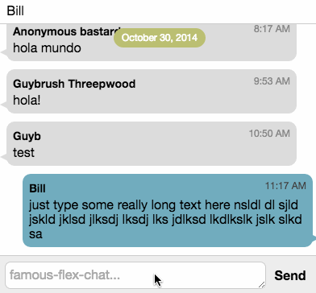

famous-flex-chat
==========

Chat-demo for famo.us using the famous-flex ScrollView. This project demonstrates how to create a cross-platform native feeling chat application using web technologies.



The following features are demonstrated:

-	True-size chat-bubbles using famous-flex/ScrollView
-	Resizable text-area input
-	Sticky headers showing the messages-day
-	Responsive design principles using famous-flex

[View the live demo here](https://rawgit.com/IjzerenHein/famous-flex-chat/master/dist/index.html)


## Content

-	[Source code](./src/TableLayout.js)
-	[Documentation](./docs/TableLayout.md)


## Build

To build the demo, make sure grunt, webpack and webpack-dev-server are installed globally:

```
npm install -g grunt
npm install -g webpack
npm install -g webpack-dev-server
```

Run npm to install all dev-dependencies:

```
npm install
```

To build the output (dist-folder), run the webpack command:

```
webpack
```


## Running

To run the demo either open `dist/index.html`

Or use the live-reload server:

```
grunt run
```


## Contribute

If you like this project and want to support it, show some love
and give it a star.


## Contact
- 	@IjzerenHein
- 	http://www.gloey.nl
- 	hrutjes@gmail.com

© 2014 - Hein Rutjes
